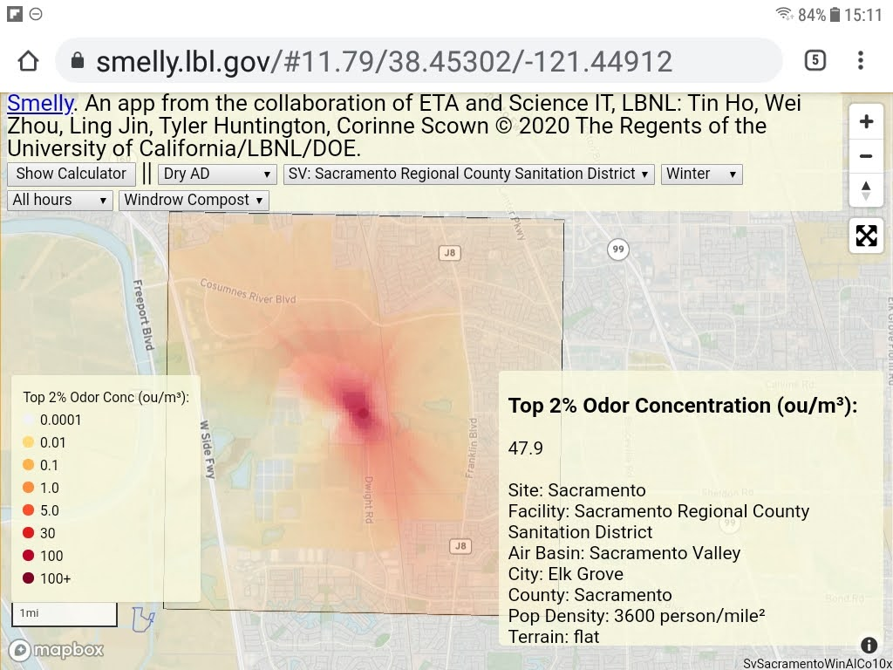
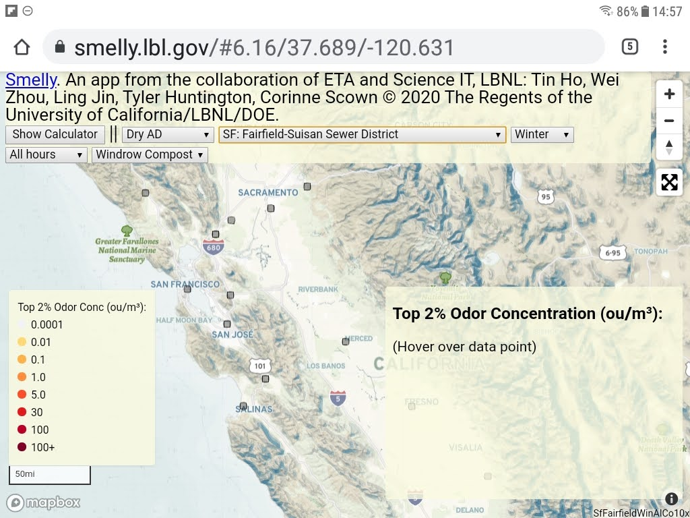
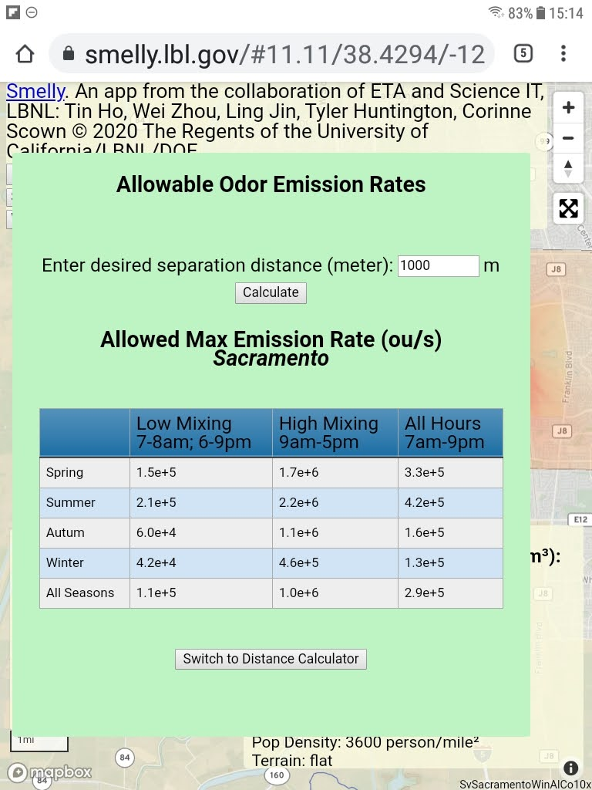

Smelly
======

Smelly is an interactive webtool displaying odor dispersion from various potential waste-to-energy sites across California. It currently displays data for dry anaerobic digestion technology with organic waste intake of 90,000 tons per year. The model addresses meteorological and geographical differences in offsite odor impacts (Jin et al. 2019). In addition to interactive display of odor dispersions, the embedded emission calculator provides two additional functionalities: (1) determine the impact distance for given onsite odor emission rates; and (2) determine allowable odor emission rates at given separation distance between the facility and its downwind communities. Please note that data and model is preliminary at this point and serve as a Proof of Concept. Additional data collection, modeling and research is needed for final application.

* Odor is very subjective. Unpleasant odors in the 5 to 10 ou/m^3 range usually trigger complaints.
* Model assumes a dry anaerobic digestion facility similar to ZWEDC with a full capacity of 90,000 ton/year organic waste intake, with odor emissions from waste processing stages estimated in Kirchstetter et al. (2020).
* Odor emissions from outdoor composting are based on the bagged outdoor composting as practiced at ZBest (Kirchstetter et al. 2020).
* Map represents the top 2 percentile in the distribution of the simulated odor concentrations over a three year period at each site.
* Odor dispersions driven by the identical emission inputs are modeled for the 25 prototypical sites that span different terrain and meteorological conditions.
* Additional funding would be needed for data collection and extension to a wider range of waste-to-energy technologies. Current data are very preliminary and used for demo purposes only. 

Application accessible at:
  * https://smelly.lbl.gov - *PROTOTYPE* data for 25 sites across california. 

References
----------

* Jin, Ling, W. Zhou, T. Ho, N. J. Brown, C. Preble, M. D. Sohn, C. D. Scown, T. Kirchstetter. 2019. "Environmental and community impact assessment of operations at an organic waste-to-energy facility" `poster presented at the AGU 2019 Conference in San Francisco <https://ui.adsabs.harvard.edu/abs/2019AGUFM.A11I2674J/abstract>`_

* Kirchstetter, Thomas W., C. D. Scown, A. Satchwell, L. Jin, S. J. Smith, C. Preble, J. Amirebrahimi, M. Sohn, N. Brown, J. Devkota, Y. He, T. Ho, R. Maddalena, S. Nordahl, N. Tang, and W. Zhou. 2020. Enabling Anaerobic Digestion Deployment to Convert Municipal Solid Waste to Energy. California Energy Commission. Publication Number: `CEC report cec-500-2020-011. <https://ww2.energy.ca.gov/2020publications/CEC-500-2020-011/CEC-500-2020-011.pdf>`_

This web-based application is a 
collaboration of 
`Energy Technology Area <http://eta.lbl.gov>`_ 
and 
`Scientific Computing <http://lrc.lbl.gov>`_
at 
`Lawrence Berkeley National Lab <http://www.lbl.gov>`_.
By: 
Tin Ho, Wei Zhou, Ling Jin, Tyler Huntington, Corinne Scown.

© 2020 The Regents of the University of California, through Lawrence Berkeley National Laboratory (“Berkeley Lab”) subject to receipt of any required approvals from the U.S. Dept. of Energy.  All rights reserved.  See `LICENSE <LICENSE>`_ for details.

`Mapbox <https://mapbox.com>`_ and its affiliates assert copyright on their maps and API.  

