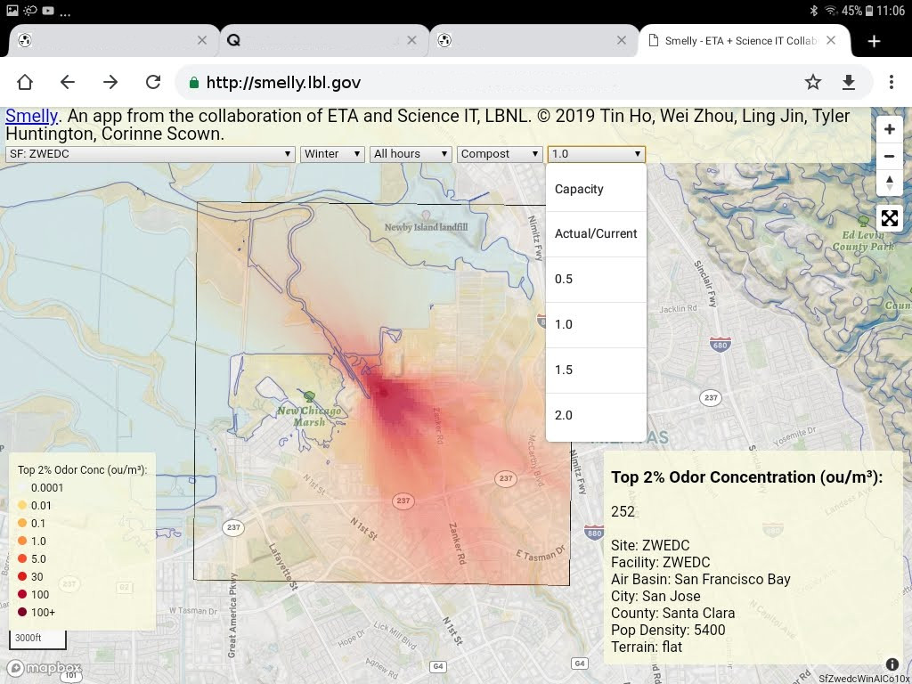

|status1|

.. |status1| image:: https://travis-ci.org/tin6150/smelly.svg?branch=master
    :target: https://travis-ci.org/tin6150/smelly

Smelly
======

Smelly is an interactive map displaying odor dispersion from various refuse processing sites across California.  Please note that data and model is preliminary at this point.  Additional data collection, modeling and research is needed.

FAQ
===

* Odor is very subjective.  This app tries to reports on chemical species that most people find unpleasant.  Concentration of 5.0 ou/m^3 is usually the threashold of human detection.
* Map represent "Top 2%" emission.  This is the emission rate at the highest concentration for 2% of the time.  eg, For a 24 hours period, about 1/2 hour will have odorous chemical at the modeled level.
* Model assume a plant capacity of 90,000 ton/year for organic waste.
* Compost is the largest contributor of offensive odor.  Different composting mechanism are employed.  This model assume plant uses *windrow compost*.
* For further details, please see our paper published at [TBA].

About
=====

This web-based application is a 
collaboration of 
`Energy Technology Area <http://eta.lbl.gov>`_ 
and 
`Scientific Computing <http://lrc.lbl.gov>`_
at 
`Lawrence Berkeley National Lab <http://www.lbl.gov>`_.

© 2019 Tin Ho, Wei Zhou, Ling Jin, Tyler Huntington, Corinne Scown.

Application accessible at:
  * https://smelly.lbl.gov 

